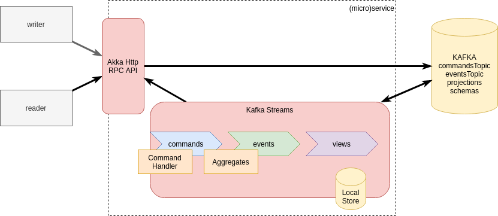

# Books Catalog Event Sourcing with Kafka Streams

Event driven/event sourcing microservice example written with:

- [Scala](https://scala-lang.org/)
- [Kafka Streams](https://kafka.apache.org/documentation/streams/)
    - [Kafka Streams - Interactive Queries](https://docs.confluent.io/current/streams/developer-guide/interactive-queries.html)
- [Akka Http](https://doc.akka.io/docs/akka-http/current/index.html)
- [Kaa Schema Registry](https://github.com/davideicardi/kaa)

## Patterns

- [Command Query Responsibility Segregation](https://docs.microsoft.com/en-us/azure/architecture/patterns/cqrs)
- [Event Driven](https://docs.microsoft.com/en-us/azure/architecture/guide/architecture-styles/event-driven)
- [Domain Driven Design](https://martinfowler.com/bliki/DomainDrivenDesign.html)
- [Event Sourcing](https://docs.microsoft.com/en-us/azure/architecture/patterns/event-sourcing)

## Domain Model

In this example I want to implement a very simple books catalog, when the user insert a list of authors, a list of books and can query the books for a specific author:

NOTE: For the current model this is for sure an over-kill architecture, but the idea is just to keep the model simple for demostration purpose.

## Logical Architecture

## Technical Architecture

## Why?

Why CQRS?
- Write and read models not always are the same
- Multiple/optimized read models
- Number of reads != number of writes

Why Event Driven?
- Allow to react to internal or external events (extensibility)
- Real time architecture

Why Event Sourcing?
- Consistency and reliability
- Events are the single source of truth
- Business logic separation
- Adding projections easily
- Dedicated storage can be added if needed for a specific projection (Elasticsearch, MongoDb, Cassandra, ...)

Why JVM?
- The only official implementation of Kafka Streams is only available for Java

Why Scala?
- It supports Java but with a functional approach and less verbose

Why Kafka?
- Fast, scalable and reliable storage
- It can be used as a database and as a message bus
- Reduce infrastructure components

Why Kafka Streams?
- "Easy" exactly-once semantic with Kafka
- Advanced stream processing capabilities (join, aggregates, ...)

Why Akka Http?
- Good framework for REST API with a rich ecosystem (Akka, Akka Stream, Alpakka, ...)
- We can use Akka also for Kafka ingestion and for distribution, see [Alpakka](https://doc.akka.io/docs/alpakka/current/index.html))
- Akka Stream can substitute Kafka Streams in certain scenarios

Why AVRO?
- Fast and compact serialization format

Why Kaa Schema Registry?
- Simple [schema registry](https://medium.com/slalom-technology/introduction-to-schema-registry-in-kafka-915ccf06b902) library with Kafka persistence

## TODO

- http apis (commands and queries)
- create topics at startup with correct properties (compact, retention, ...) 
- test with multiple instances
